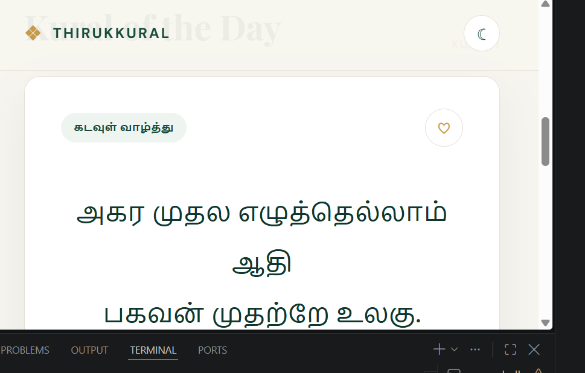
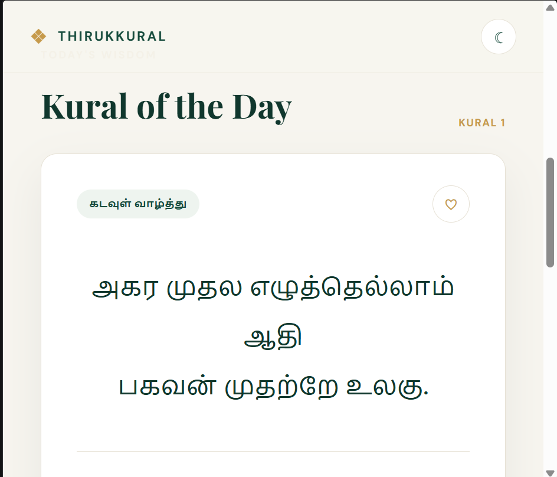
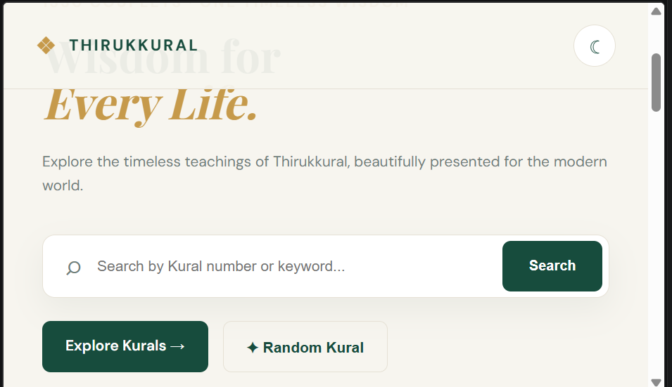
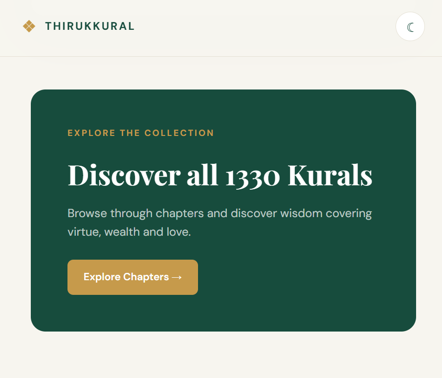
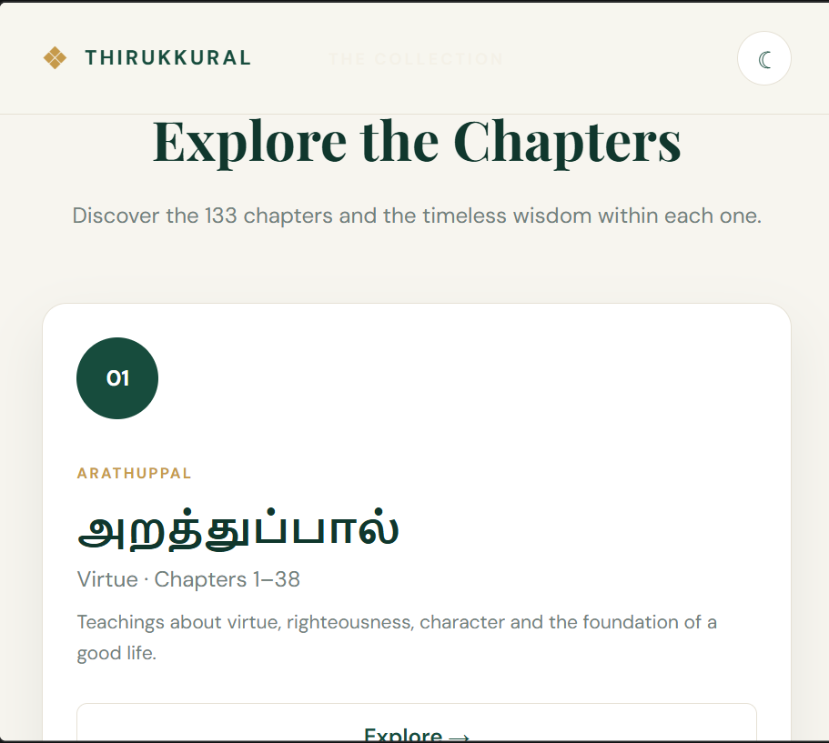
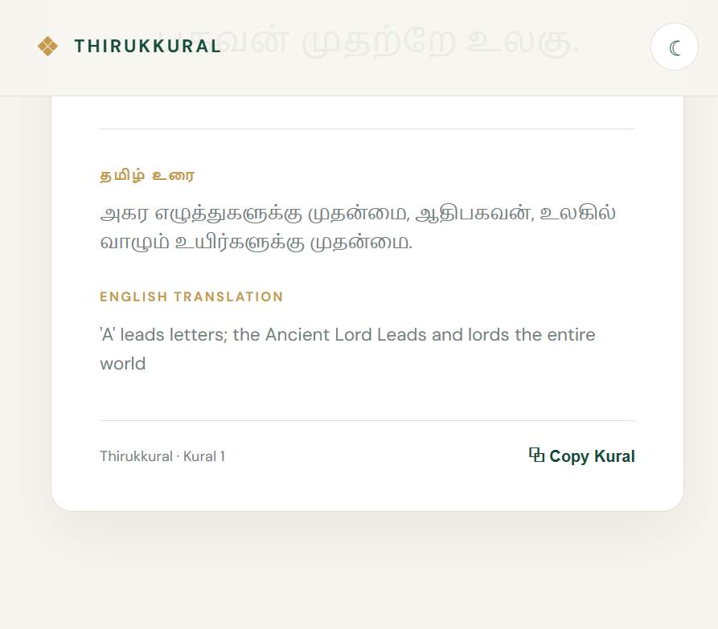
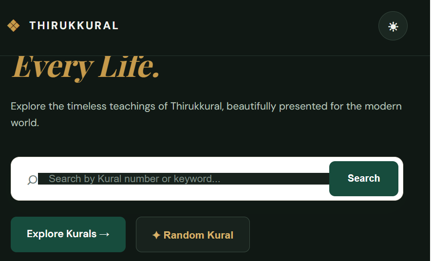

# Thirukkural Explorer

A simple web application to explore Thirukkural using Flask and the Thirukkural API.

## Features

- View Thirukkural by number
- Get a random Kural
- Search Kurals
- Explore chapters
- Add Kurals to favourites
- Copy Kural
- Light and dark mode
- Responsive design

## Technologies Used

- Python
- Flask
- HTML
- CSS
- JavaScript
- Thirukkural API

## Screenshots

### Home


### Kural


### Explore


### Discover


### Chapters


### Favourites


### Dark Mode


## How to Run

Clone the repository:

```bash
git clone https://github.com/Ancylinnaho08/THIRUKKURAL-FLASK